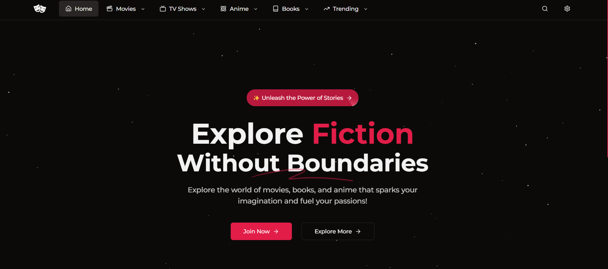

# Fictionix: Explore, Dream, Discover

Fictionix is a versatile platform for exploring movies, TV shows, novels, books, and anime. Built using TMDB API, Fictionix aims to deliver a seamless and engaging experience for entertainment enthusiasts. The platform currently focuses on movies, with plans to integrate Jikan and Google Books APIs for anime and book data.



## Table of Contents

1. [Introduction](#introduction)
2. [Features](#features)
3. [Tech Stack](#tech-stack)
4. [Installation](#installation)
5. [Running the Project](#running-the-project)
6. [Deploying](#deploying)
7. [Contributing](#contributing)
8. [License](#license)

## Introduction

Fictionix is designed to bring together diverse forms of entertainment into one comprehensive platform. Users can discover and explore detailed information about their favorite movies, TV shows, books, and anime.

## Features

### Current Features

- ✅ **Movie Database**: Search and explore movies using the TMDB API, featuring:
  - Detailed information about movies, including cast, crew, synopsis, and release date.
  - High-quality movie posters and backdrops.
  - Trending and popular movies updated daily.
- ✅ **Responsive Design**: Optimized for mobile, tablet, and desktop devices.
- ✅ **Dynamic Search**: Find movies quickly with an autocomplete feature.
- ✅ **Movie Details**: Includes:
  - Genre and runtime information.
  - Ratings from TMDB.
  - Cast and crew lists with clickable profiles.
- ✅ **Theming**: Toggle between light and dark themes to suit user preferences.

### Planned Features

#### Frontend Enhancements

- ❌ **Multi-Language Support**: Add support for additional languages (e.g., Spanish, French).
- ❌ **Accessibility Improvements**: Ensure compliance with WCAG standards for a more inclusive experience.
- ❌ **Customizable Layouts**: Allow users to rearrange and personalize the user interface.

#### Content Expansion

- ❌ **Anime Integration**: Fetch anime details using the Jikan API, including:
  - Episode lists and streaming availability.
  - Anime genres and seasonal updates.
- ❌ **Book Integration**: Include novels and books using the Google Books API, featuring:
  - Author biographies.
  - Book reviews and recommendations.
- ❌ **TV Shows**: Expand to support TV show exploration with:
  - Episode guides and release schedules.
  - User ratings and reviews.

#### User Experience

- ❌ **User Profiles**: Enable users to:
  - Save favorite content and create personalized watchlists.
  - Track viewing history.
- ❌ **Social Sharing**: Share favorite movies, books, and anime on social media platforms.
- ❌ **Recommendation Engine**: Provide tailored content suggestions based on user activity and preferences.
- ❌ **Reviews and Ratings**: Allow users to:
  - Rate movies, books, and anime.
  - Write and share reviews.
- ❌ **Community Features**: Foster interaction with features like:
  - Discussion forums.
  - Polls and voting on content.

#### Advanced Features

- ❌ **Offline Mode**: Cache data for offline access to previously viewed content.
- ❌ **Progressive Web App (PWA)**: Enable installation on devices for a native app-like experience.
- ❌ **Gamification**: Introduce rewards for user engagement, such as badges and leaderboards.
- ❌ **Content Scheduling**: Schedule reminders for upcoming movie releases or new book arrivals.

#### Analytics and Insights

- ❌ **User Insights Dashboard**: Provide statistics on user activity, including:
  - Favorite genres.
  - Most-watched or read content.
- ❌ **Content Trends**: Highlight popular movies, books, and anime across different regions.

## Tech Stack

- **Frontend**: React, Next.js
- **Styling**: Tailwind CSS
- **API**: TMDB API (current), Jikan API (planned), Google Books API (planned)
- **State Management**: Context API (current), Redux (planned for scalability)
- **Deployment**: Vercel


## Installation

Follow these steps to set up Fictionix locally:

1. Clone the repository:
   ```bash
   git clone https://github.com/yourusername/fictionix.git
   ```
2. Navigate to the project directory:
   ```bash
   cd fictionix
   ```
3. Install dependencies:
   ```bash
   npm install
   ```

## Running the Project

1. Start the development server:
   ```bash
   npm run dev
   ```
2. Open your browser and navigate to `http://localhost:3000`.

## Deploying

1. Build the project for production:
   ```bash
   npm run build
   ```
2. Deploy the build to your hosting provider (e.g., Vercel, Netlify).

## Contributing

Contributions are welcome! Here's how you can get started:

1. Fork the repository.
2. Create a new branch:
   ```bash
   git checkout -b feature-name
   ```
3. Commit your changes:
   ```bash
   git commit -m 'Add new feature'
   ```
4. Push to your branch:
   ```bash
   git push origin feature-name
   ```
5. Open a Pull Request on GitHub.

## License

This project is licensed under the MIT License. See the `LICENSE` file for more details.
